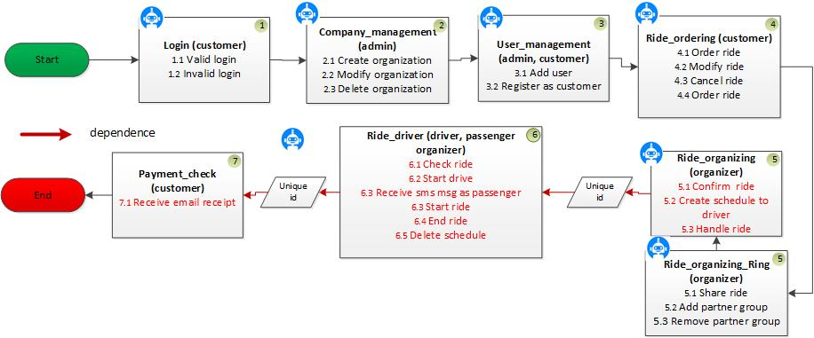
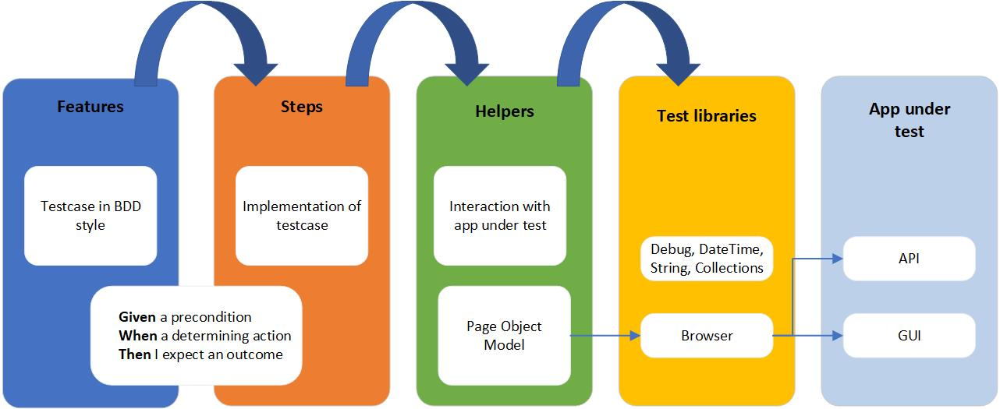

<p align="center">
  
</p>

# RF Test automation for Edustusautot
Robot Framework test automation for EdustusautotApp.


## TABLE OF CONTENTS
* [Robot Framework Test Automation Architecture](#robot-framework)
* [Getting Started](#getting-started)
* [Infrastructure](#infrastructure)
* [Dockerized test run](#docker)

## ROBOT FRAMEWORK TEST AUTOMATION ARCHITECTURE

###  Workflow tests




All tests have these phases:
* Precondition (in setup)
* Action (do something to the system)
* Verification (validate result)
* Cleanup (in teardown)

--> Test are written using high level "gherkin" style


###  GUI element locator strategy

* In code (as attribute): data-test-id = "feature-name-type"
* In robot: xpath=//*[@data-test-id = "feature-name-type"]  

###  Layered test automation architecture



### Structure of files
```
AcceptanceTests
|----Suites
  |---Login_features
  |  |----login_features.robot        #Testcases in Gherkin format (Given/When/Then)
  |  |----login_steps.robot           #Implementation of the Gherkin test
  |  |----login_helpers.robot         #Interaction with GUI via page object model
  |  |----__init__.robot
  |  
  |----Registration_features
  |  |----registration_features.robot
  |  |----registration_steps.robot
  |  |----registration_helpers.robot 
  |  |----__init__.robot
  |
  |----...etc.
  |   |--- ...
  |   |--- ...
  |   |---- __init__.robot
  |
  |----Global_resources              #Shared resources
      |-----Global_variables.robot  
      
|----Results                          #Output of Robot Framework


```

## GETTING STARTED
 
### Installing

Installation steps:
* Install Python 3.8 & PIP (Add to PATH) (Python 3.7.4 is minimum for Browser)
* Install node.js e.g. from https://nodejs.org/en/download/ (14.x recommended)  
* Create your personal Python virtual environment outside VCS: C:\venv `py -m venv <name for this virtual env, for example ea>`
* Activate virtual environment: `.\ea\Scripts\activate`
* With the venv activated, navigate to project VCS folder \AcceptanceTests and install requirements.txt: `pip install -r requirements.txt`
* Install the node dependencies: run `rfbrowser init` in your shell  
* Supporting editor tool (e.g. Visual Code or PyCharm)

###  How to run

Example test execution:

```
robot -l trace -v ENVIRONMENT:lab -v chargeapisecret:<keyvault> -v HEADLESS:false -i orderflow -d robotresults Suites
```  
Where  
-l (log level) is set to trace,  
-v (variable) environment is set to lab,  chargeapisecret is set (In Azure pipeline it comes from release library, In locally you must type it)
-v headless is set to false (browser is started with GUI),  
-i only tests tagged with "orderflow" are run and  
-d all output (video, reports, logs) are outputted into robotresults directory

All testsuites in one folder:

```
robot Suites
```

Based on tags:

```
robot -i <tagname> path\to\test
```

Run against locally running service:
```
robot --variable ENVIRONMENT:local Suites
```

## INFRASTRUCTURE 


## DOCKER

Folder also contains Docker and Docker Compose files so you can execute the acceptance tests against your environment (https://localhost:5001/) without installing Python and dependencies on your own machine. You can start the test with the following command (note that in the first run it will take many minutes to build the Docker container but the next runs will be fast)

**Prerequisite:** As Docker uses host.docker.internal domain name for accessing localhost so you'll need to change app URL in your appsettings.json to `"PublicUrl": "https://host.docker.internal:5001",`

In AcceptanceTests folder:
```
$ docker-compose up
Starting robot ... done
Attaching to robot
...
```

The results are written to local machine to folder RobotResults.

You can cleanup the container with:
```
$ docker-compose down
Removing robot ... done
Removing network acceptancetests_default
...
```

## AUTHORS  
* Janne Juopperi
* Niina Rantanen (rantani)

## CONTRIBUTORS
* Tommi Laukkanen
